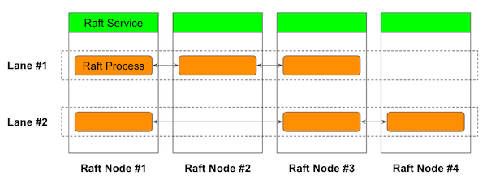

# sorock

A Multi-Raft implementation in Rust language.

[Documentation](https://akiradeveloper.github.io/sorock/)

## Features

- Implements all core [Raft](https://raft.github.io/) features for production use.
- Supports Multi-Raft. Mutliple Raft processes can coexist in a single OS process so they can share resources efficiently.
  - Tested with 1000 shards.
  - Batched heartbeat optimization is implemented.
- Based on [Tonic](https://github.com/hyperium/tonic) and efficient gRPC streaming is exploited in log replication and snapshot.
- [Phi Accrual Failure Detector](https://github.com/akiradeveloper/phi-detector) is used for leader failure detection. The adaptive algorithm allows you to not choose a fixed timeout number in prior to deployment and makes it possible to deploy Raft node in even geo-distributed environment.

## Author

Akira Hayakawa  
EMail: ruby.wktk@gmail.com
