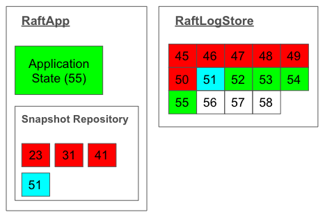

# Application State

Inside Raft Process, `RaftApp` and Log are most important data structures for application state.

## RaftApp

`RaftApp` is an abstraction that represents the application state and the snapshot repository.
The snapshot repository isn't separated because the contents of the snapshot is 
strongly coupled with the application state.

The application state can be updated by applying the log entries.
In this figure, the lastly applied entry is of index 55.

`RaftApp` can arbitrarily generate a snapshot to compact the log.
When `RaftApp` makes a snapshot and stores it in the snapshot repository,
The newest snapshot is immediately picked up by an internal thread 
to update the log (right in the figure) by replacing the snapshot entry.
In this figure, the snapshot index is 51.

Old snapshots will be garbage collected.

Snapshots might be fetched from other nodes.
This happens when the Raft process is far behind the leader and
the leader doesn't have the log entries as they are previously garbage collected.

## Log

In the figure, log entries from 45 to 50 are scheduled for garbage collection.
Snapshot entry is of index 51 and it is guaranteed that the corresponding snapshot
exists in the snapshot repository. 52 to 55 are applied.
56 or later are not applied yet: They are either uncommitted or committed.