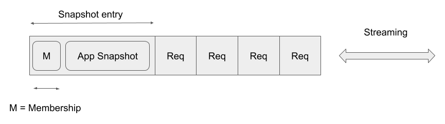

# Log and Snapshot

To explain how I've designed the log and the snapshot in this library,
tracking back the evolution of the design would be the quickest way.

## v1: Snapshot as a log entry

lol has started as a company project and it's aim is to 
replicate data in the same order in the cluster then we considered Raft would fit.
That was when my journey began.
The name "lol" comes from our project. (one of the two l means log but the another is secret)
It is not a joke.

Since our aim is to replicate the log, the log centric design is natural for me to start with.
Also, I don't like to implement InstallSnapshot RPC as described in Raft dissertation
because it would certainly introduce extra complexity to the software.

That way, the design v1 is drawn.

In this design, everything is log entry. Everything includes not only the 
user command but snapshot and special entries to change the membership.
Log entry has a pair of term and index to the previous entry so to ensure the log consistency,
and the payload in sequence of byte for versatility.
Since everything is log entry, everything in done under Raft's log replication mechanism.
This is so simple and easy to implement. But in terms of versatility, this design choice is not the optimimal.

Why is it not optimal? The main reason is the snapshot's size is limited by the
system memory since we must read or write the entry after putting it in buffer. (Consider Put method in RocksDB) We could avoid this by some implementation hacks like cutting snapshot payload into streaming chunks but this would destroy the interfaces and, not beatiful at all. Then we have to find a new design.

## v2: Snapshot Inventory

The problem must root in the fact that we try to deal with completely different things, snapshot and normal entries, in the same way. That made me come up with the idea of *snapshot inventory*.

In Raft dissertation, InstallSnapshot RPC is PUSH operation because it is initiated in leader node and the snapshot chunks are sent in streaming to followers.

My idea is *completely the opposite*: `GetSnapshot` RPC is initiated by follower and leader sends back the snapshot in streaming after finding it in the snapshot inventory. This is a PULL operation.

In design v2, application snapshot is moved out from the snapshot entry and then put in snapshot inventory. The snapshot entry still exists and replicated to slow followers in the same way as in v1. The difference is: when follower received snapshot entry, it calls `GetSnapshot` RPC to the sender (in this case it must be a leader) to request the application snapshot in stream. When the `GetSnapshot` RPC is completed and the snapshot is stored in the snapshot inventory of its own, the follower node commits the snapshot entry just like the way filesystem firstly stores the file data and lastly metadata to complete the operation.

The greatest point of this algorithm is that leader node doesn't have to find slow nodes but slow node is noticed in the way of log replication. This makes the implemetation pretty simple and thus bug-free.