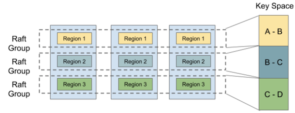
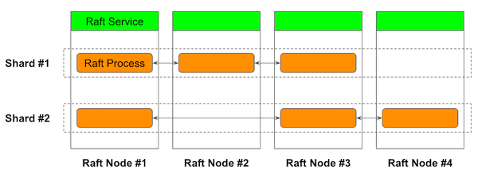

# Multi-Raft

[Raft](https://raft.github.io/) consensus algorithm in recent years is a widely used building block of distributed applications.
The algorithm is about consensus on the sequence of log entries, which are applied to a state machine.
When the two log entries are identical, then the resulting state is identical too.
For such reason, it is also called **replicated state machine**.

The typical usage of the Raft algorithm is to implement a distributed key-value store.
However, naive implementation will suffer from scalability issues due to the seriality of the algorithm.
Let's consider putting (k1,v1) and (k2,v2) in the data store, naive implementation can't handle these two concurrently
because the all write operations are serialized.

Sharding is a common solution to this kind of problem.
If the k1 and k2 are enough distant in the key space, then the operations can be handled concurrently by sharded Raft clusters.
TiKV is known to use this technique ([ref](https://tikv.org/deep-dive/scalability/multi-raft/)).

There are two ways in implementing a multi-raft.
One is deploying multiple Raft clusters independently.
One of the known problems of this approach is that resources like IP addresses or ports must be
allocated per node to identify them.
This introduces unnecessary complexity in deployment.
Another problem is that shards can't share the resources efficiently.
In the implementation of a key-value store, the embedded datastore should be shared among the shards
for efficient I/O such as write batching.
For these problems, I will take the another approach.

Sorock implements **in-process multi-raft**.
As the name implies, sorock allows you to place multiple **Raft processes** in a single gRPC server process.
These Raft processes can form a Raft cluster on independent **shards**.

