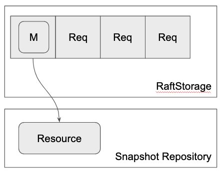

# Snapshot Repository

In the previous section, we have learned that the snapshot is placed in somewhere outside the log entry and copied to other nodes in streaming.

The snapshot entity that is made from the stream and sent in stream is called **snapshot resource**.

The library does't care what it actually is and where it is actually placed but let's call it **snapshot repository**.

In `RaftApp`'s `process_write`, you can create a new snapshot resource and save it in the snapshot repository.
The function then return `MakeSnapshot::CopySnapshot` to tell the `RaftCore` that a new snapshot is made.
If `RaftCore` is told that a new snapshot is made it tries to commit a snapshot entry corresponding to it.

Again, the library doesn't care what the snapshot resource actually is.
It can be a file in an object storage or a snapshot of some storage backend like RocksDB.
It is fully up to the implementor.