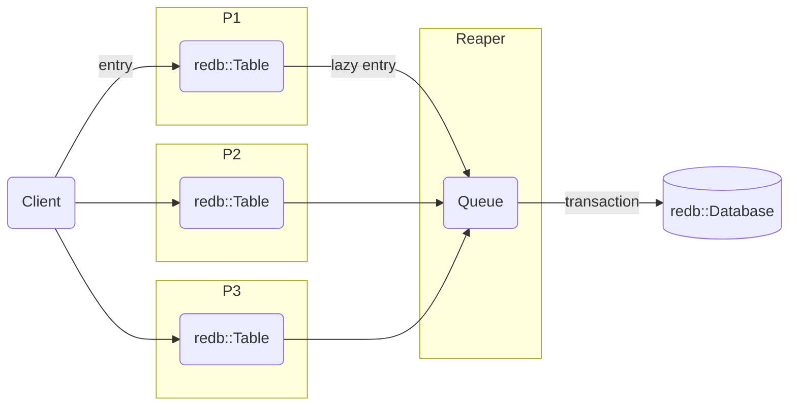

# Batched Write

In multi-raft, multiple shards process write requests. Conceptually, each shard maintains its own log for entry insertion.

Having a physically independent log for each shard isn't efficient as each write requires a transaction to persist the data on the storage.

However, an optimization technique called "batching" can be used. Here, each shard maintains a virtual log, and the entries are temporarily queued in a shared queue. These queued entries are then processed in a single transaction, reducing the number of transactions.

This approach often presents a throughput versus latency dilemma. However, this implementation increases throughput without sacrificing latency.

