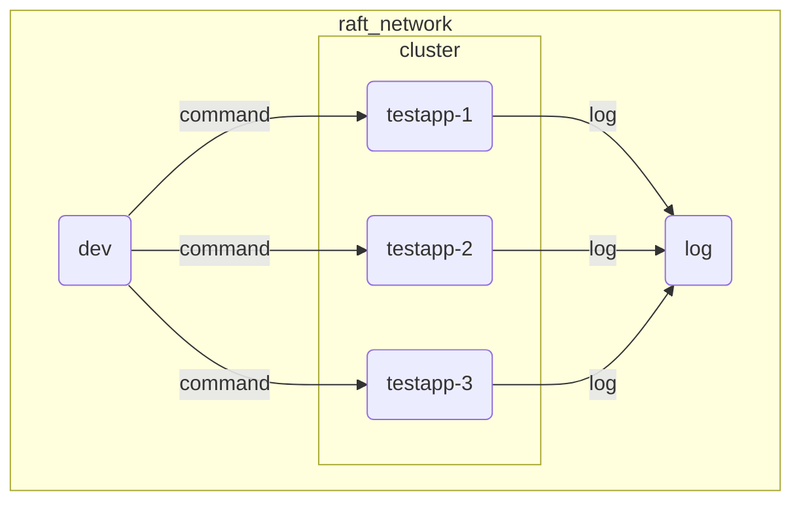

# Development

## Build

The proto file should be compiled manually if you changed the proto file.
In this case, please run `cargo run -p codegen`.

## Testing

For testing, sorock makes use of docker-compose.

A docker image called testapp is built and the tests create some instances of it for testing: test code is running on dev container and it accesses the docker deamon in the host. In GHA, the tests are run in the same way.

The log output in the stdout/stderr is collected into the log container. This is quite useful for debugging. So here is how you can run the tests for development.

- `docker compose build` to build test application.
- TERM1: `./log` to start log watcher.
- TERM2: `./dev` to start the dev container.
- TERM2: `cargo test`.

## Benchmark

You can run benchmark in a similar way as testing.

- `docker compose build` to build test application.
- TERM1: `./dev`
- TERM1: `cargo +nightly bench`.

## Documentation

You can modify the documentations.

For editing the mdbook under doc/ directory,
you can run `mdbook serve doc` to start the local mdbook server.