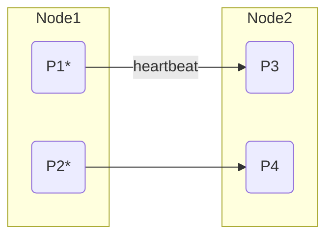
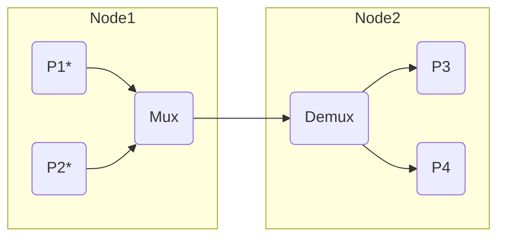

# Heartbeat Multiplexing

In Raft, leader is responsible for periodically sending heartbeats to all followers to maintain the leadership.
In Multi-Raft, without any optimization load from the the heartbeats can be non-negligible.
However, we can optimize to reduce the heartbeat RPCs by multiplexing the heartbeats from different shards.

## Problem of naive implementation

In the following diagram, we have two nodes Node1 and Node2 and there are two shards.
A Process is a leader if it is denoted with an asterisk (*):
P1 is sending the heartbeats to the P3 and P2 to P4 as well.
So there are two RPC messages sent from P1 to P3 and P2 to P4 independently.

## Multiplexing heartbeats

To reduce the number of RPCs to only one, we can introduce multiplexer and demultiplexer in the nodes.
The two heartbeats are buffered in the multiplexer and sent in a batched RPC to the destination node.
In the destination node, the demultiplexer will split the batched RPC into individual heartbeats
and send them to the corresponding processes.

In this case the reduction rate is 2.
But what would be the reduction rate in general.
Let's do some math.

## Math: Reduction rate

Let's consider there are N nodes and L shards.
Each shard have K replication and leader processes are
balanced among the nodes.

In this case,
the total number of heartbeats sent in period is LK.
And the total directed paths connecting two nodes is N(N-1) and
these heartbeats are evenly attributed to these paths.
Therefore, the number of heartbeats sent in each path is LK/(N(N-1))
and this is the reduction rate.
For example, if there are 5 nodes and 1000 shards with 3 replication,
the reduction rate is 150.
