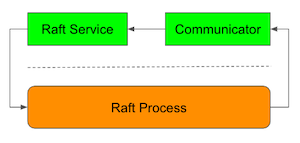

# Raft Process

The core of multi-raft is Raft process.
Each multi-raft server has one or more Raft processes.

To implement multi-raft,
sorock implements Raft process as it is agnostic to
detailed node communications through gRPC.
Since the Raft process doesn't know about the IO,
we call it **Pure Raft**.



To make Raft process to communicate with other Raft processes
through network, `RaftDriver` must be provided.
Everything about actual network communication is encapsulated under `RaftDriver`.

```rust
impl RaftProcess {
    pub async fn new(
        app: impl RaftApp,
        log_store: impl RaftLogStore,
        ballot_store: impl RaftBallotStore,
        driver: RaftDriver,
    ) -> Result<Self> {
```