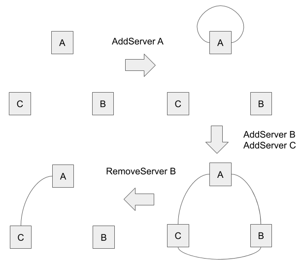

# Cluster Management

In lol, adding and removing a server to and from the cluster is just an extension of normal log replication. This means the cluster must have a leader to accept spacial requests: `AddServer` and `RemoveServer` which leads to append a special command called `ClusterConfiguration`.

When you start a single Raft server, you may think the node automatically forms a small cluster with one node and become a leader but this is a wrong assumption because starting a second server will cause **split brain** because there are two leaders at the same time. This is what Raft's election algorithm tries to avoid by choosing only one leader in a single term.

You now learned that starting a server does not automatically form a cluster nor give it a leadership. However, this leads to an other problem: How to add servers? Since there is no leader to accept `AddServer` request.

In lol, When a server received `AddServer` request and it doesn't belong to any cluster, it forms a cluster with only itself, regardless of the leadership. This is called **cluster bootstrapping**.

