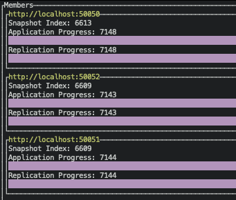

# lol-monitor

A tui software to monitor the cluster status such as
membership, replication progress, server health, etc.

## Usage

```
USAGE:
    lol-monitor <ID>

ARGS:
    <ID>    Some node in the cluster.

FLAGS:
    -h, --help       Print help information
    -V, --version    Print version information
```

## Screenshot



## Test

1. ./dev
2. cd lol-monitor
3. make test